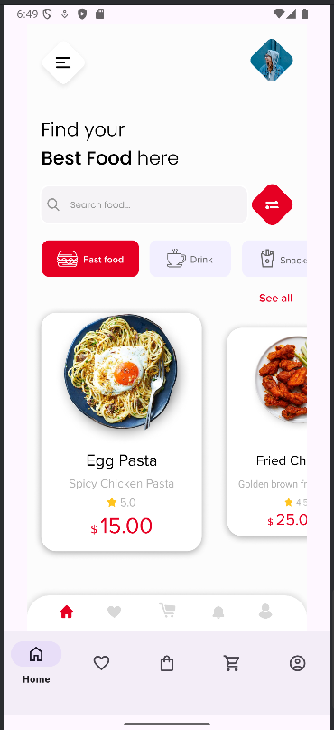
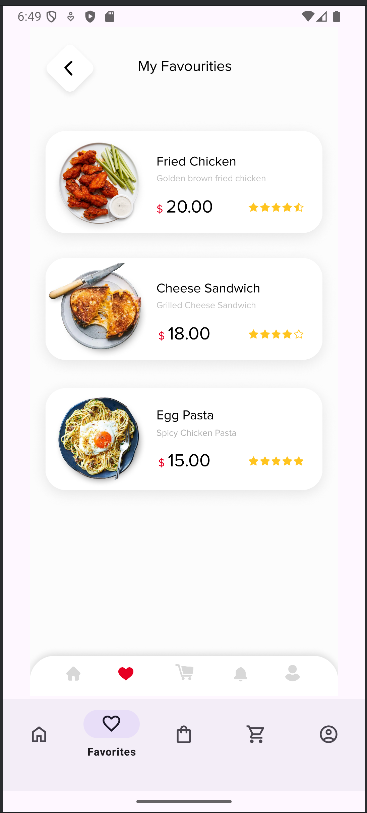
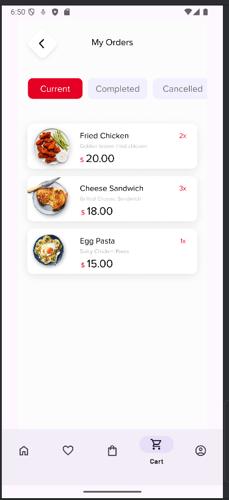
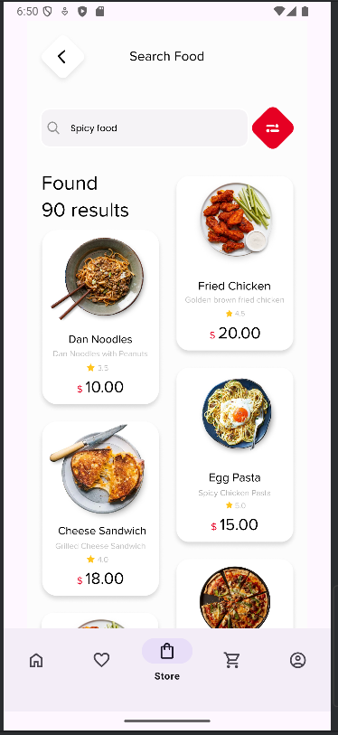
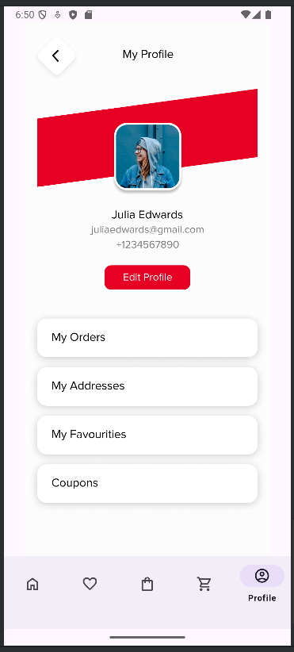

# 🛒 E-commerce Mobile App

Una aplicación móvil de comercio electrónico moderna con interfaz intuitiva y navegación fluida.

## 📱 Características

### Pantallas Principales
- **🏠 Home**: Pantalla principal con productos destacados y categorías
  
 
- **❤️ Favorites**: Lista de productos favoritos del usuario
  
  
- **🛒 Cart**: Carrito de compras con gestión de productos
  

- **🏪 Store**: Catálogo completo de productos con filtros
  

- **👤 Profile**: Perfil del usuario y configuraciones
  


### Funcionalidades
- ✅ Navegación por pestañas (Bottom Navigation)
- ✅ Interfaz de usuario moderna y responsive

## 📂 Estructura del Proyecto

```
app/
├── manifests/
├── kotlin+java/
│   └── com.example.myapplication21/
│       ├── Cart.kt
│       ├── Favorites.kt
│       ├── Home.kt
│       ├── MainActivity.kt
│       ├── Profile.kt
│       └── Store.kt
├── res/
│   ├── drawable/
│   ├── layout/
│   │   ├── activity_main.xml
│   │   ├── fragment_cart.xml
│   │   ├── fragment_favorites.xml
│   │   ├── fragment_home.xml
│   │   ├── fragment_profile.xml
│   │   └── fragment_store.xml
│   ├── menu/
│   │   └── bottom_nav.xml
│   ├── mipmap/
│   ├── values/
│   └── xml/
└── screenshots/ (agregar esta carpeta para las imágenes)
```
